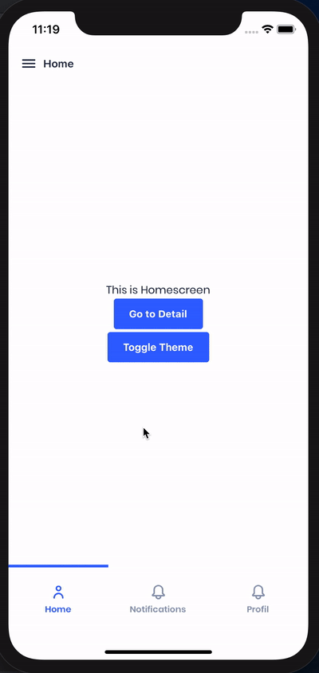
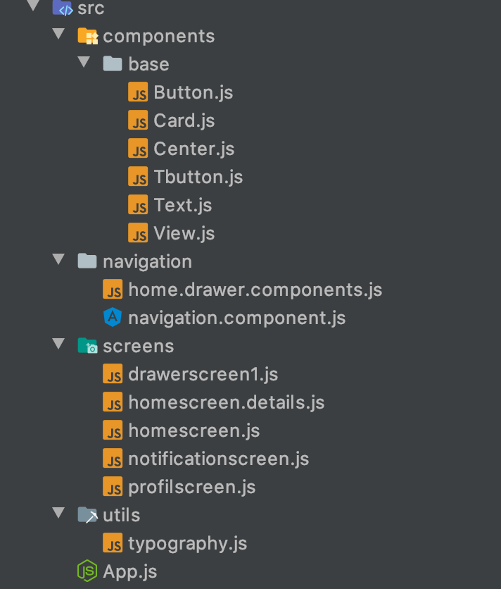

# 🚀 React Native Starter Kit 


# 👋🏽 Giriş

Merhabalar, bir süredir React Native üzerine kendimi geliştirmeye çalışıyorum. React Native i bilenler bilir ki düzgün bir uygulamayı geliştirmek için routes, componentlar , style biçimi gibi bir çok şeyi baştan yapısını kurmak zorunda kalıyoruz ve bu zaman alan bir şey oluyor. Her uygulama için nerdeyse aynı yapıyı kullanabiliyoruz ve bunları baştan kurmak zorunda kalıyoruz. Bu yüzden internette aradığımda şöyle ihtiyacım olan herşeyi basitçe veren bir boilerplate göremedim. Ben de @ademilter abimizin de kursundan esinlenerek bir starter yapmaya karar verdim. İçinde kurstakinden ayrı olarak dark mode özelliği, bottom barla çalışan drawer menusu, ayrı font eklenmeye hazır olması gibi özellikleri de ekleyerek güzel bir çalışma yaptığımı düşünüyorum . UI kütüphanesine gelirsek birçok kütüphane araştırmaya girdim ve aralarında en güçlü alt yapıya ve görsel açıdan en tatmin eden UI Kitten i tercih ettim. Kendi sitesinden componentlere bakarak ister hazır olanları alıp hızlıca uygulamayı inşa edebilir ister de react-native in stok componentlerini veya UI Kittenin componentlerini kendizi düzenleyerek Styled System ile istediğiniz gibi kullanabilirsiniz.

## Kullanılan Kütüphaneler

* [React Native](https://facebook.github.io/react-native/) 0.61.5
* [React Navigation](https://github.com/react-navigation/react-navigation)  ^5.1.0
* [UI Kitten](https://github.com/akveo/react-native-ui-kitten) 4.4.1
* [Styled Components](https://styled-components.com/) 5.0.1
* [Styled System](https://styled-system.com/) 5.1.5

Ekstra Özellikler:
* Dark mod özelliği.
* Hem Bottom Bar hem de Drawer Menu ile her türden navigasyon harmanlanabilir.
* Custom font eklenebilir haldedir.
* UI Kitten ile gelen bütün nimetler (ikonlar, eva design system vs.).

## Dizin Yapısı

   
   


## 🚀 Yükleme

Gerekli modülleri yüklemek için ister yarn ister npm install ile yükleyebilirsiniz. Tavsiyem yarn ı kullanmanız.
```
$ git clone https://github.com/hasanaydins/react-native-kitten-boilerplate.git
$ cd react-native-kitten-boilerplate
$ yarn
```
Linkleme için `react-native link` 0.60 sürümünden sonra tavsiye edilmiyor o yüzden pod ile yükleyiniz.

```
$ yarn run pod
```
### Simulatör ile çalıştırmak için

    $ yarn ios
veya

    $ yarn android
    


Hata ile karşılaşırsanız bana yazabilirsiniz. Ben de düzeltmiş olurum. ✌🏼
 
 
[Hasan Aydın](https://www.hasanaydins.com)
